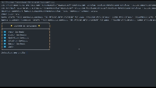

# Prueba Tecnica 1 - HACKABOSS

Este es el código de la primera prueba técnica.
La cual es un sistema de gestion de empleados.
Puede visualizar el funcionamiento de la aplicación a continuación ⬇️

## Demo



## Instalación
Clonar repositorio de GitHub

```bash
  git clone https://github.com/EzzCream/OscarRodriguezCarmona_pruebatec1.git
```

Se tiene que correr el .sql para generar la base de datos en Mysql
## Requerimientos

#### Requerimientos funcionales

| RF         | Accion                      | Description                                                                                       |
|:-----------|:----------------------------|:--------------------------------------------------------------------------------------------------|
|  RF1       |  Crear empleado             |  Se debe de poder ingresar la información para un nuevo empleado y guardarlo en la base de datos. |
|  RF2       |  Listar empleados           |  Se debe de poder listar todos los empleados de la base de datos.                                 |
|  RF3       |  Actualizar empleado        |  Se debe de poder buscar al empleado por ID y modificar su información en la base de datos.       |
|  RF4       |  Eliminar empleado          |  Se debe de poder buscar al empleado por ID y eliminarlo de la base de datos.                     |
|  RF5       |  Buscar empleado por cargo  |  Se debe de poder buscar a todos los empleados que tengan el cargo buscado.                       |

#### Requerimientos no funcionales

| RF          | Accion             | Description                                                             |
|:------------|:-------------------|:------------------------------------------------------------------------|
|  RNF1       |  Menu interactivo  |  Para un mejor manejo se debe de tener un menu interactivo y atractivo. |
|  RNF2       |  Java 17           |  Se debe de utilizar Java 17 para la programacion.                      |
|  RNF3       |  JPA               |  Se debe de utilizar JPA para acceder a la bvase de datos               |
|  RNF4       |  MySQL             |  La base de datos debe de estar en MySQL                                |
|  RNF5       |  Colecciones       |  Utilizar colecciones.                                                  |

## Supuestos

- Se asume que todos los campos de un empleado (nombre, apellido, cargo, salario y fecha de inicio) son obligatorios al momento de agregar o actualizar un registro.
- La fecha de inicio debe estar en un formato válido (ISO 8601: YYYY-MM-DD).
- El proceso de actualización requiere un identificador único del empleado (por ejemplo, el campo id generado por la base de datos) para garantizar que se edite el registro correcto.
- Se asume que la eliminación de un empleado es una operación irreversible. No se implementa una funcionalidad de "papelera" o "archivado".
- El menú interactivo en ASCII es diseñado para su uso en una consola o terminal, con opciones numéricas para navegar entre funcionalidades.
- La búsqueda por cargo es sensible a mayúsculas o minúsculas.

## Clases

- PruebaTecnica1:
  La clase PruebaTecnica1 es la clase principal de la aplicación de gestión de empleados. Su propósito es la interacción entre las diferentes capas de la aplicación, permitiendo al usuario realizar diversas operaciones CRUD (Crear, Leer, Actualizar y Eliminar) y ejecutar consultas en el sistema mediante un menú interactivo.
- Empleado:
  La clase Empleado representa una entidad en el modelo lógico de la aplicación y está diseñada para mapearse a una tabla de la base de datos llamada empleado dentro de la tabla empleados. Esta clase encapsula toda la información relacionada con un empleado y proporciona métodos para acceder y modificar sus propiedades.
- ControladorPersistencia:
  La clase ControladorPersistencia actúa como un intermediario entre la capa lógica de la aplicación y la capa de persistencia basada en JPA. Su propósito es gestionar las operaciones CRUD y consultas relacionadas con la entidad Empleado. Esta clase utiliza un controlador específico, EmpleadoJpaController, para interactuar directamente con la base de datos.
- EmpleadoJpaController:
  La clase EmpleadoJpaController es un controlador de persistencia que encapsula las operaciones de manejo de la entidad Empleado en una base de datos. (Autogenerado con NetBeans)
- FechaUtil:
  La clase FechaUtil es una utilidad que proporciona un método estático para obtener una fecha en el formato adecuado (yyyy-MM-dd).
- Menu:
  La clase Menu proporciona una interfaz de usuario basada en texto para interactuar con la aplicación de gestión de empleados. Incluye métodos para mostrar opciones al usuario, capturar entradas, y realizar operaciones relacionadas con los empleados como creación, listado, modificación, eliminación y búsqueda.

## Metodos

#### Crear Empleado
**Método:** `crearEmpleado(Empleado emp)`  
**Descripción:**  
Recibe un objeto de tipo `Empleado` y lo persiste en la base de datos utilizando el método `create` de `EmpleadoJpaController`.

#### Obtener Empleados por Cargo
**Método:** `obtenerEmpleado(String cargo)`  
**Descripción:**  
Devuelve una lista de empleados que tienen un cargo específico. Llama al método `findByCargo` de `EmpleadoJpaController`.

#### Eliminar Empleado
**Método:** `eliminarEmpleado(int id)`  
**Descripción:**  
Elimina un empleado de la base de datos en función de su ID.

**Manejo de Excepciones:**  
Captura la excepción `NonexistentEntityException` si el empleado con el ID especificado no existe y registra el error en el log.

#### Traer Empleado por ID
**Método:** `traerEmpleado(int id)`  
**Descripción:**  
Recupera un empleado específico de la base de datos utilizando su ID. Llama al método `findEmpleado` de `EmpleadoJpaController`.

#### Listar Todos los Empleados
**Método:** `traerEmpleados()`  
**Descripción:**  
Devuelve una lista de todos los empleados en la base de datos. Llama al método `findEmpleadoEntities` de `EmpleadoJpaController`.

#### Modificar Empleado
**Método:** `modificarEmpleado(Empleado emp)`  
**Descripción:**  
Actualiza los datos de un empleado existente en la base de datos.

#### Formatear fecha
**Método:** `fechaFormato()`  
**Descripción:**
- Lee una fecha ingresada por el usuario a través de la consola.
- Valida que la fecha cumpla con el formato especificado `yyyy-MM-dd`.
- Convierte la fecha a un objeto `LocalDate` para su posterior uso.